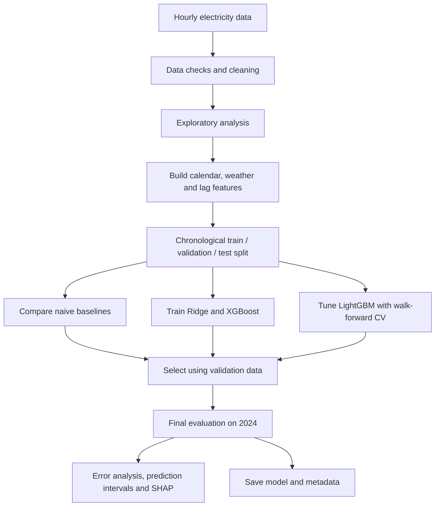

# Day-Ahead Electricity Load Forecasting

A machine-learning project to forecast hourly electricity demand for the next day. The notebook explores demand patterns, builds time-aware features, compares baseline forecasts with regression and boosting models, and evaluates the final model on data from 2024.

## Results at a glance

| Metric | Result |
|---|---:|
| Test period | 2024 |
| LightGBM RMSE | **149.9 MW** |
| LightGBM MAPE | **2.13%** |
| Best naive baseline RMSE | 321.0 MW |
| 90% prediction interval coverage on test data | 89.3% |

These are the results reported by the notebook. They depend on the supplied dataset and the current feature and validation setup.

## Project workflow



## What the project covers

- Checks timestamp order, missing values and unusual readings.
- Rebuilds an hourly datetime index and calendar features.
- Explores daily, weekly and seasonal demand patterns.
- Creates features from calendar information, weather and historical demand.
- Keeps demand-derived features at least 24 hours behind the target to match the day-ahead forecast setting.
- Compares three simple baselines with Ridge regression, XGBoost and tuned LightGBM.
- Uses chronological splits and expanding-window cross-validation rather than randomly shuffling time-series rows.
- Evaluates the final model on the held-out 2024 period.
- Examines forecast errors, prediction intervals and SHAP feature importance.
- Audits leakage and early-stopping choices from the earlier version of the pipeline.

## Models and baselines

**Baselines**
- `Naive-24`: demand from the same hour on the previous day.
- `Naive-168`: demand from the same hour in the previous week.
- Same-hour four-week mean.

**Models**
- Ridge regression
- XGBoost
- LightGBM with randomized hyperparameter search and walk-forward validation

## Dataset

The notebook expects a CSV file named `electricityDemand.csv` in the project directory. The data used in the analysis covers **1 January 2020 to 31 December 2024** and includes these main columns:

- `Timestamp` — date
- `hour` — hour of day
- `Temperature` — temperature reading
- `Humidity` — humidity reading
- `Demand` — electricity demand in MW

The dataset is not included in this repository. Add your own copy if you have permission to share it. The notebook's data-loading cell should read the file using `pd.read_csv(DATA_PATH)`.

## Run locally

### 1. Clone or download the project

```bash
git clone `https://github.com/ParthaRoy10/Electricity-Load-Forecasting`
cd `Electricity-Load-Forecasting`
```

### 2. Create and activate a virtual environment

**Windows (PowerShell)**

```powershell
python -m venv .venv
.\.venv\Scripts\Activate.ps1
```

**macOS / Linux**

```bash
python3 -m venv .venv
source .venv/bin/activate
```

### 3. Install dependencies

```bash
python -m pip install --upgrade pip
pip install -r requirements.txt
```

### 4. Add the dataset

Place `electricityDemand.csv` in the project root, alongside the notebook. Check that the file contains the columns listed in the Dataset section.

### 5. Start Jupyter

```bash
jupyter notebook
```

Open the forecasting notebook and run the cells from top to bottom. The notebook creates an `artifacts/` directory for the saved model and JSON metadata.

## Output files

After the final cells run successfully, the notebook saves:

```text
artifacts/
├── lgbm_day_ahead.txt
├── model_metadata.json
└── metrics.json
```

- `lgbm_day_ahead.txt` — trained LightGBM model.
- `model_metadata.json` — feature names, selected parameters, training window and test metrics.
- `metrics.json` — selected test metrics, audit results and prediction-interval coverage.

## Important limitations

- **Observed weather is used in place of weather forecasts.** A real day-ahead system would need weather forecasts available at prediction time.
- Temperature values in the dataset appear capped at 3 °C and 50 °C, so the true extremes may not be represented.
- The model under-forecasts demand slightly on average in 2024.
- The dataset does not specify a country, which limits a meaningful public-holiday analysis.
- Five years of data may not contain enough examples of rare events such as severe heat waves or outages.

## Possible next steps

1. Evaluate using archived weather forecasts instead of observed weather.
2. Add an appropriate public-holiday calendar and other external variables.
3. Test methods to account for demand growth.
4. Monitor errors and prediction-interval coverage over time.
5. Package preprocessing and inference into a reusable module or API.

## Repository structure

```text
.
├── Load_Forecasting_Natural_Style.ipynb
├── electricityDemand.csv          # add locally; not included
├── requirements.txt
├── README.md
└── artifacts/                     # generated when the notebook runs
```

## Tools used

Python, pandas, NumPy, Matplotlib, Seaborn, scikit-learn, XGBoost, LightGBM, SHAP and Jupyter Notebook.

---

**Note:** This is an educational forecasting project. The reported test results are specific to this dataset and do not guarantee the same performance on a different electricity grid or in a production setting.
